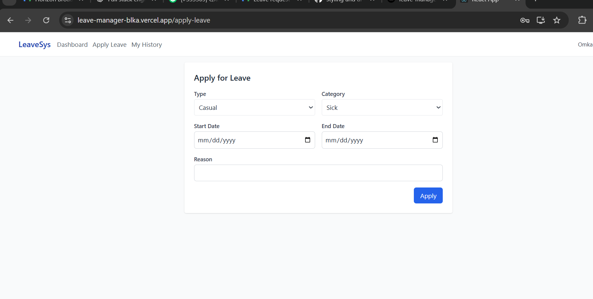
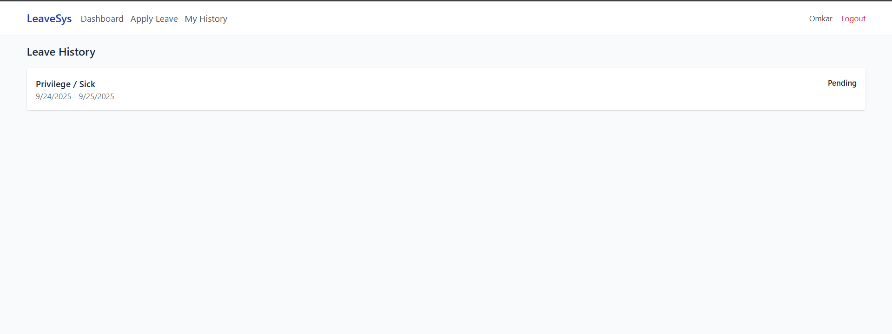
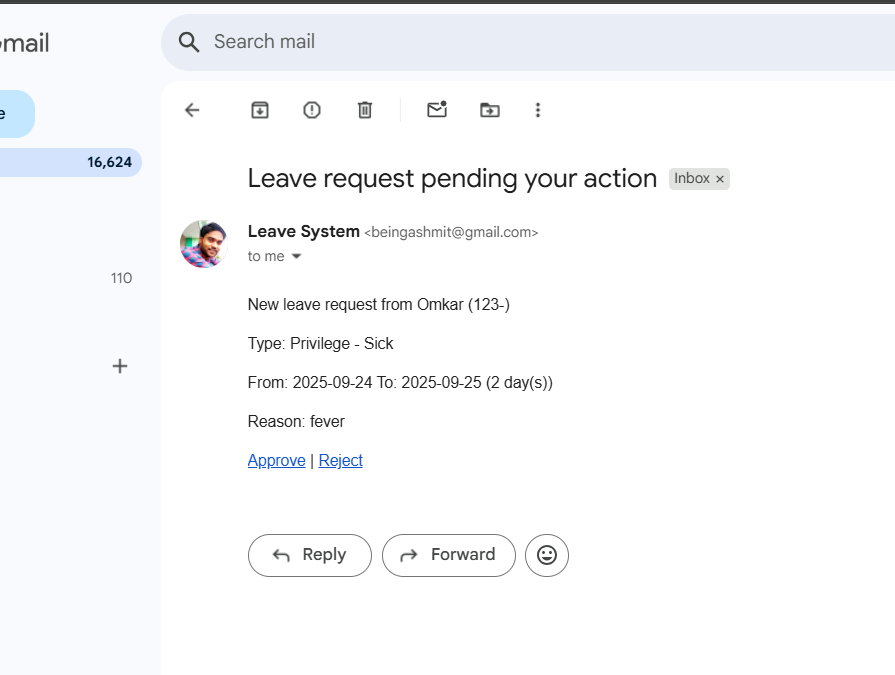

Create leave:
User --> Frontend --> POST /leaves --> Backend validates -> DB
                                Backend -> Notify manager (email)
Manager --> Approve --> PATCH /leaves/:id/approve -> Backend updates DB -> notify user

# Employee Leave Management System

Full-stack app with Node.js/Express + MongoDB backend and React + Redux frontend.

## Quick start (local)

### Backend
cd backend
cp .env.example .env   # set values
npm install
npm run dev

### Frontend
cd frontend
cp .env.example .env
npm install
npm start

Open http://localhost:3000 (frontend) and backend runs on http://localhost:8082

## Features
- Register/login for Employee & Admin (JWT)
- Employee: apply leave, view balance & history
- Manager/Admin: approve/reject, adjust balances
- Emails via Nodemailer with Approve/Reject links
- Cron-based auto-escalation after 24 hours

Home / Login (not logged in)

This is the app home page when you are not logged in.

Use Email and Password to log in.

Important: Use a real email address for registration/login because the app sends notification emails to that address.

If you don’t have an account, click Create account to go to the registration page.

  registered yourself by filling all the fields, for now all the fields are required and you can registered as employee or admin and password should be atleast 5 character
once you registered successfully you'll get this and it will redirect you again to the login page from there you have to login again using the same email and password. once you logged in successfully you'll get this dashboard from here you can apply for new leave by clicking on apply leave all the fields are mandatory..
after applying for leave your dashboard will look like this
from here you'll able to see all your history of leaves  

admin will recieve a mail for the applied leave something like this from here admin can approve or reject the leave or he can open the dashboard his dashboard will look like this  
from here also he can approve or reject the leave.

the ui is not that much appealing for now because of time constraints because I had some time constraints and did not have the bandwidth but the functionality is working fine

